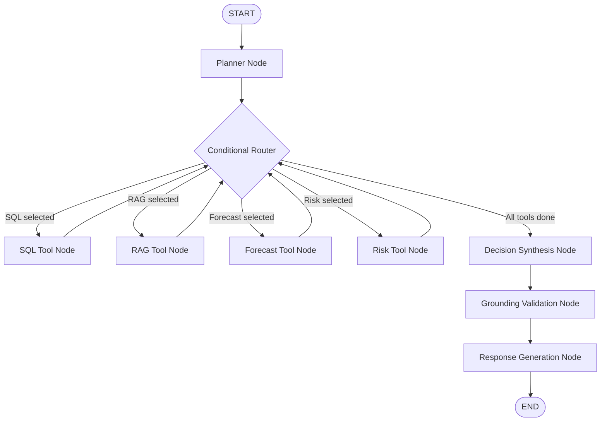

# LangGraph Multi-Tool Agent Orchestrator Documentation

## Overview

The **LangGraph Multi-Tool Agent Orchestrator** in **SupplyChain AI** acts as a centralized decision-support intelligence engine. It coordinates specialized application tools built across Phase 3 through Phase 7 into a single, controlled, stateful workflow graph:

1. **Phase 3**: Machine Learning XGBoost Demand Forecast Model
2. **Phase 4**: Deterministic Inventory Risk & Recommendation Engine
3. **Phase 5**: RAG Vector Knowledge Base Retrieval Engine (PostgreSQL + pgvector)
4. **Phase 7**: Safe Natural-Language-to-SQL Tool (AST + Regex Read-Only Validator)

---

## 1. Why LangGraph?

Traditional LLM chains (e.g. standard sequential pipelines or monolithic prompts) suffer from:
- **Rigid execution order**: Inability to dynamically decide whether to retrieve documents, run database queries, or calculate inventory risk.
- **Uncontrolled loops**: Risk of LLMs getting stuck in infinite agent execution loops.
- **Hidden internal state**: Difficulties in auditing which tools ran and why a specific decision was generated.

LangGraph provides a **StateGraph architecture** that combines LLM reasoning with deterministic graph transitions. Key benefits include:
- **Strongly Typed Shared State**: Explicit data contracts passed across graph nodes.
- **Deterministic Routing**: Conditional edges that control exactly when and how tools run.
- **Safety Boundaries**: Guarantees that LLMs never execute raw database commands or overwrite inventory state.
- **Bounded Execution Limits**: Pre-set recursion step limits prevent runaway loops.

---

## 2. Agent Architecture Topology



---

## 3. Shared Agent State (`AgentState`)

The graph uses a strongly typed `AgentState` (`TypedDict`) persisted and mutated sequentially across nodes:

```python
class AgentState(TypedDict, total=False):
    question: str
    intent: str
    entities: Dict[str, Any]
    selected_tools: List[str]
    plan_reasoning: str
    tool_results: Dict[str, Any]
    sql_result: Optional[Dict[str, Any]]
    rag_result: Optional[Dict[str, Any]]
    forecast_result: Optional[Dict[str, Any]]
    risk_result: Optional[Dict[str, Any]]
    decision: Optional[Dict[str, Any]]
    validation_result: Optional[Dict[str, Any]]
    final_response: Optional[Dict[str, Any]]
    warnings: List[str]
    errors: List[str]
    sources: List[Dict[str, Any]]
    tool_trace: List[Dict[str, Any]]
```

---

## 4. Graph Nodes & Responsibilities

### A. Planner Node (`planner.py`)
- Analyzes user questions using structured LLM output (`PlannerOutput`).
- Determines question intent (`INVENTORY_RISK`, `FORECAST`, `SUPPLIER_INFORMATION`, `POLICY_QUESTION`, `CONTRACT_QUESTION`, `GENERAL_SUPPLY_CHAIN`).
- Extracts entities (`product_id`, `sku`, `supplier`, `warehouse_id`, `horizon_days`).
- Selects required tools (`SQL`, `RAG`, `FORECAST`, `RISK`).
- Features a deterministic heuristic fallback to ensure 100% resilience if LLM parsing fails.

### B. Conditional Router (`router.py`)
- Evaluates `selected_tools` vs `tool_results`.
- Routes execution to missing tool nodes sequentially (`SQL` -> `RAG` -> `FORECAST` -> `RISK`).
- Transitions to `decision_node` when all selected tools have finished.

### C. Tool Nodes (`nodes.py` & `tools.py`)
- **`sql_tool_node`**: Invokes `SQLService` to generate, validate, and execute read-only SQL queries.
- **`rag_tool_node`**: Invokes `retrieve_relevant_chunks()` to search procurement policy and contract documents.
- **`forecast_tool_node`**: Invokes `forecast_product()` to calculate multi-step XGBoost demand predictions.
- **`risk_tool_node`**: Invokes `evaluate_product_inventory_risk()` to evaluate safety stock, reorder point, stockout timeline, and recommendation actions.

### D. Decision Node (`decision_node`)
- Synthesizes findings across tool outputs.
- Ensures numerical figures (reorder points, stockout dates, forecast totals) come strictly from tool results rather than LLM imagination.

### E. Grounding Validation Node (`validation_node`)
- Validates cited document chunks against actual RAG vector search results.
- Strips hallucinated sources and verifies numerical consistency.

### F. Response Node (`response_node`)
- Formats structured `AgentQueryResponse` using Phase 6 `LLMProvider`.
- Appends complete step execution trace (`tool_trace`).

---

## 5. Multi-Tool Execution Workflows

| Query Pattern | Selected Tools | Execution Flow |
| :--- | :--- | :--- |
| *"Which suppliers have an on-time delivery rate below 85%?"* | `[SQL]` | `Planner` -> `SQL Tool` -> `Decision` -> `Validation` -> `Response` |
| *"What does Supplier ABC's contract say about late deliveries?"* | `[RAG]` | `Planner` -> `RAG Tool` -> `Decision` -> `Validation` -> `Response` |
| *"Which products are at risk of stockout in next 14 days?"* | `[RISK]` | `Planner` -> `Risk Tool` -> `Decision` -> `Validation` -> `Response` |
| *"Why is SKU-102 at high risk?"* | `[RISK, FORECAST]` | `Planner` -> `Risk Tool` -> `Forecast Tool` -> `Decision` -> `Response` |
| *"Supplier ABC is delayed. Which products are affected and what does contract say?"* | `[SQL, RAG, RISK]` | `Planner` -> `SQL` -> `RAG` -> `Risk` -> `Decision` -> `Response` |

---

## 6. Safety & Security Guardrails

1. **Read-Only SQL Enforcement**: All database queries generated during agent execution pass through `SQLValidator`. AST & regex rules block DML/DDL operations (`DROP`, `DELETE`, `INSERT`, `UPDATE`, `ALTER`, etc.).
2. **Numerical Grounding**: Inventory metrics, stock levels, safety stock values, and forecast numbers are calculated by deterministic Python services. The LLM explains relationships but cannot override numbers.
3. **Citation Sanitization**: RAG sources are verified against retrieved vector chunk metadata.
4. **Human-In-The-Loop (No Autonomous Action)**: The agent recommends actions (`REORDER`, `EXPEDITE`, `MONITOR`, `TRANSFER`, `ESCALATE`) but cannot execute purchase orders or modify database records without explicit user confirmation.

---

## 7. Execution Step Trace (`tool_trace`)

Every step appends a safe audit log item:

```json
[
  {
    "step": "planner",
    "status": "completed",
    "timestamp": "2026-09-13T00:54:00Z",
    "detail": "Selected tools: ['RISK', 'FORECAST'] | Intent: INVENTORY_RISK"
  },
  {
    "step": "risk_tool_node",
    "status": "completed",
    "timestamp": "2026-09-13T00:54:01Z",
    "detail": "Risk Evaluated: Product=1 | Level=HIGH | Action=REORDER"
  },
  {
    "step": "forecast_tool_node",
    "status": "completed",
    "timestamp": "2026-09-13T00:54:02Z",
    "detail": "Forecast Produced: Product=1 | Total Demand=420.5"
  },
  {
    "step": "decision_node",
    "status": "completed",
    "timestamp": "2026-09-13T00:54:03Z",
    "detail": "Synthesized decision across tools: ['RISK', 'FORECAST']"
  },
  {
    "step": "response_node",
    "status": "completed",
    "timestamp": "2026-09-13T00:54:04Z",
    "detail": "Structured final response generated."
  }
]
```

---

## 8. REST API Reference

### `POST /api/v1/agent/query`

**Request Body**:
```json
{
  "question": "Why is SKU-102 at high stockout risk?",
  "supplier_filter": "ABC Industrial",
  "top_k": 5
}
```

**Response**:
```json
{
  "question": "Why is SKU-102 at high stockout risk?",
  "summary": "SKU-102 is at high stockout risk because projected 14-day demand exceeds available stock.",
  "intent": "INVENTORY_RISK",
  "answer": "Comprehensive analytical answer...",
  "risk_level": "HIGH",
  "affected_products": [...],
  "recommended_actions": [...],
  "explanation": "Detailed explanation...",
  "confidence": 0.92,
  "sources": [...],
  "data_used": ["RISK", "FORECAST"],
  "warnings": [],
  "tool_trace": [...]
}
```

### `GET /api/v1/agent/graph`

Returns the Mermaid string representation of the graph architecture.
