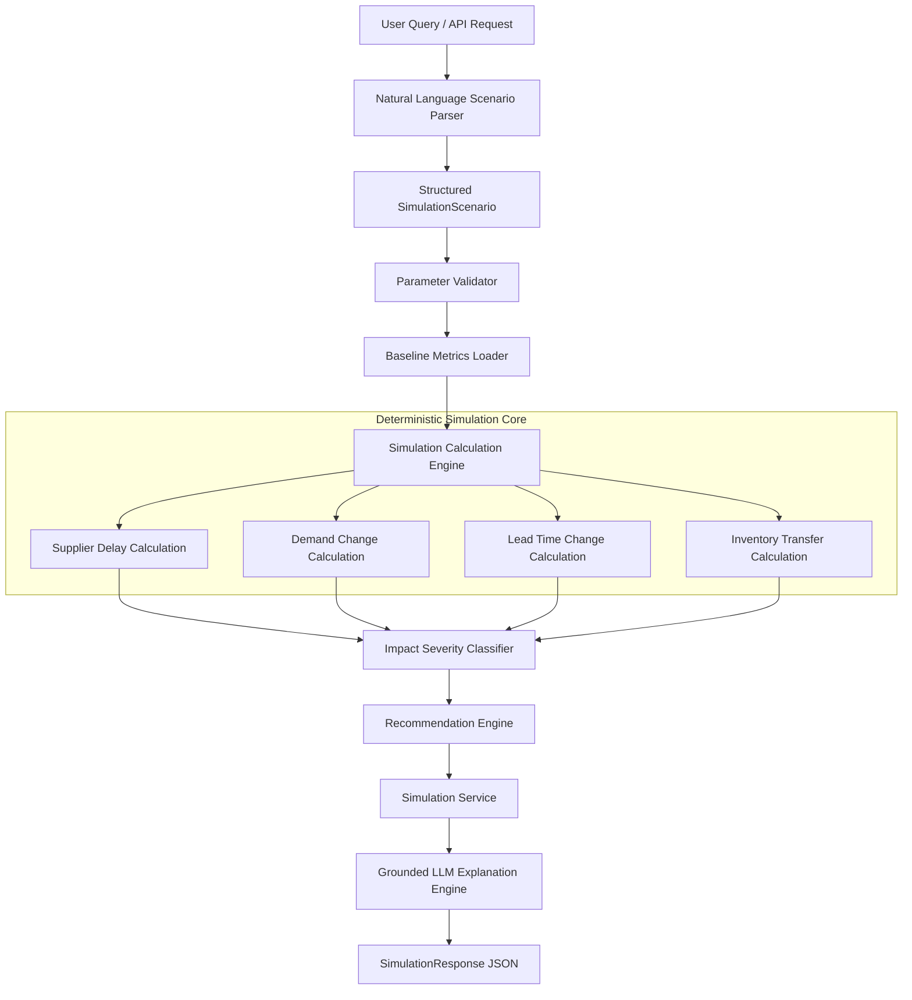
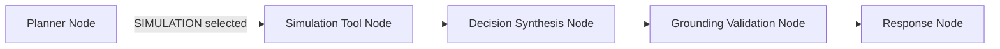

# Phase 9 — What-If Simulation Engine Documentation

## Overview

The **What-If Simulation Engine** in **SupplyChain AI** enables deterministic, interactive scenario modeling for enterprise supply chain decision support. It empowers supply chain managers and copilot agents to ask hypothetical questions such as:

- *"What if Supplier ABC is delayed by 14 days for product P-100?"*
- *"Simulate a 30% surge in demand for product PROD-102."*
- *"What happens if lead time increases to 21 days?"*
- *"Transfer 200 units of product P-100 from WH-MAIN to WH-NORTH."*

The engine calculates projected stockout risks, safety stock requirements, reorder points, days of supply, financial impact, and actionable recommendations **100% deterministically in Python** without making any mutating changes (`UPDATE`, `INSERT`, `DELETE`) to the underlying PostgreSQL database.

---

## 1. Key Architectural Principles

1. **Zero Database Mutation**:
   - All scenario modifications are applied in-memory to baseline metric snapshots.
   - The PostgreSQL database remains strictly read-only during simulation execution, ensuring safety for enterprise production systems.

2. **Deterministic Mathematical Modeling**:
   - Replaces stochastic or random simulations with repeatable, explainable formulas.
   - Every input scenario produces identical output metrics when evaluated against identical baseline data.

3. **Total Inventory Conservation**:
   - In stock transfer scenarios, stock decrements at the source warehouse are exactly matched by stock increments at the destination warehouse.
   - Total system inventory is strictly conserved ($Stock_{source} + Stock_{dest} = \text{Constant}$).

4. **Grounded Explanation Generation**:
   - Simulation outputs pass exact numerical delta metrics to the LLM explanation generator.
   - LLM explanations cite exact calculated numbers without numerical hallucination.

5. **Seamless LangGraph Agent Integration**:
   - Exposed as a first-class tool (`ToolEnum.SIMULATION`) within the multi-tool LangGraph agent orchestrator.

---

## 2. Component Topology



---

## 3. Supported Scenario Types

| Scenario Type | Trigger Terms | Key Parameter | Primary Metrics Affected |
| :--- | :--- | :--- | :--- |
| `SUPPLIER_DELAY` | "delay", "late", "shipment delayed" | `delay_days` | Effective Lead Time, Days of Supply, Stockout Risk, Safety Stock |
| `DEMAND_CHANGE` | "demand surge", "demand spike", "demand drop" | `demand_change_percent` | Daily Demand, Days of Supply, Reorder Point, Stockout Risk |
| `LEAD_TIME_CHANGE` | "lead time increases", "lead time to X days" | `new_lead_time_days` | Effective Lead Time, Days of Supply, Stockout Risk, Safety Stock |
| `INVENTORY_TRANSFER` | "transfer stock", "move stock from X to Y" | `transfer_quantity`, `source_warehouse_id`, `destination_warehouse_id` | Source/Dest Current Stock, Days of Supply, Stockout Risk |

---

## 4. Mathematical Foundations & Calculation Formulas

### 4.1 Supplier Delay Scenario
Given baseline lead time $L_{base}$ and added delay $\Delta L$:
$$\text{Effective Lead Time } L_{eff} = L_{base} + \Delta L$$
$$\text{Projected Daily Demand } D_{proj} = D_{base}$$
$$\text{Safety Stock } SS = z \times \sigma_D \times \sqrt{L_{eff}}$$
$$\text{Reorder Point } ROP = (D_{proj} \times L_{eff}) + SS$$
$$\text{Days of Supply } DOS = \frac{\text{Current Stock}}{D_{proj}}$$

### 4.2 Demand Change Scenario
Given baseline daily demand $D_{base}$ and demand change percentage $\Delta D\%$:
$$D_{proj} = D_{base} \times \left(1 + \frac{\Delta D\%}{100}\right)$$
$$DOS_{sim} = \frac{\text{Current Stock}}{D_{proj}}$$
$$ROP_{sim} = (D_{proj} \times L_{base}) + SS$$

### 4.3 Inventory Transfer Scenario
Given source current stock $S_{src}$ and transfer quantity $Q_{transfer}$:
$$S_{src, sim} = \max(0, S_{src} - Q_{transfer})$$
$$S_{dest, sim} = S_{dest} + Q_{transfer}$$
$$\text{Total System Stock Conservation: } S_{src, sim} + S_{dest, sim} = S_{src} + S_{dest}$$

---

## 5. Impact Severity Classification

The engine evaluates metric deltas to assign an objective severity rating:

- **`CRITICAL`**: Stockout projected within effective lead time ($DOS < L_{eff}$ or Days of Supply $< 7$).
- **`HIGH`**: Reorder point exceeded or Stockout Risk $> 65\%$.
- **`MEDIUM`**: Stockout Risk between $35\%$ and $65\%$, or excess stock created ($DOS > 90$).
- **`LOW`**: Minor metric changes with Stockout Risk between $15\%$ and $35\%$.
- **`NEUTRAL`**: Negligible metric impact.

---

## 6. Integration with LangGraph Orchestrator

The simulation engine is registered in `app/agents/tools.py` under `execute_simulation_tool()`.

### Router Flow


---

## 7. REST API Endpoints

### 7.1 Natural Language Query Endpoint
`POST /api/v1/simulation/query`

**Request**:
```json
{
  "text": "What if supplier delay increases by 10 days for product P-100?",
  "product_id": "P-100"
}
```

**Response**:
```json
{
  "scenario": {
    "scenario_type": "SUPPLIER_DELAY",
    "product_id": "P-100",
    "delay_days": 10
  },
  "baseline": {
    "total_current_stock": 450,
    "effective_lead_time_days": 14,
    "projected_daily_demand": 25.0,
    "stockout_risk_score": 0.22,
    "days_of_supply": 18.0
  },
  "simulated": {
    "total_current_stock": 450,
    "effective_lead_time_days": 24,
    "projected_daily_demand": 25.0,
    "stockout_risk_score": 0.68,
    "days_of_supply": 18.0
  },
  "impact": {
    "stockout_risk_delta": 0.46,
    "days_of_supply_delta": 0.0,
    "severity_rating": "HIGH",
    "summary": "10-day supplier delay increases stockout risk by 46.0%."
  },
  "recommendations": {
    "action_type": "EXPEDITE_PO",
    "recommended_actions": [
      "Expedite open Purchase Orders for P-100",
      "Raise reorder point from 400 to 650 units"
    ]
  },
  "explanation": "Simulating a 10-day supplier delay for product P-100 increases effective lead time from 14 to 24 days...",
  "latency_ms": 42.5
}
```

### 7.2 Structured Execution Endpoint
`POST /api/v1/simulation/run`

**Request**:
```json
{
  "scenario": {
    "scenario_type": "INVENTORY_TRANSFER",
    "product_id": "P-100",
    "source_warehouse_id": "WH-MAIN",
    "destination_warehouse_id": "WH-NORTH",
    "transfer_quantity": 100
  }
}
```

---

## 8. Verification & Test Suite

The test suite is implemented in `backend/tests/test_simulation.py` and verifies:

- ✅ Scenario natural language parsing & parameter extraction
- ✅ Parameter boundary validation (preventing negative delays or invalid transfer quantities)
- ✅ Deterministic math for Supplier Delay, Demand Change, Lead Time Change, and Inventory Transfer
- ✅ Conservation of mass/inventory during stock transfers across warehouses
- ✅ Zero database mutation guarantee (asserting DB stock levels remain identical before and after simulation)
- ✅ Impact severity classification & recommendation generation
- ✅ LangGraph agent routing to `SIMULATION` tool
- ✅ REST API `/query` and `/run` endpoint validation
